# Problems

## Homotopy

1.  Show that any non-surjective map $f: X \rightarrow S^n$ is homotopic to the constant map.
2.  Let $f,g \rightarrow S^n$ be such that $\forall x\in X, f(x) \neq -g(x)$. Show that $f \simeq g$.
3.  Let $\alpha: S^n \to S^n,~ \alpha(p) = -p$ be the antipodal map on $S^n$. Show that $n ~\text{odd} \implies f \simeq \text{id}$.
4.  Show that $X$ is homotopy-equivalent to a point $\iff$ $\text{id}_X \simeq g$ for some constant map $g$.
5.  Show that $S^1 \times I \simeq M$, the Mobius strip.
6.  Show that $\mathbb{R}^3 - S^1 \simeq S^1 \vee S^2$.
7.  Classify the letters of the alphabet up to homeomorphism, and up to homotopy.
8.  **REVISIT**
   Let $f,g : S^1 \rightarrow X$,
   $P = X \cup_f B^2 \cong X \coprod B^2 / \sim$, where $x \sim f(x)$,
   $Q = X \cup_g B^2$.
   Show that $f\simeq g \implies P\simeq Q$.

## Fundamental Group

1. Show that $x,y\in X$ path & simply-connected $\implies$ all paths from $x$ to $y$ are homotopic rel $\{0, 1\}$.
2. Show that for $X$ path connected, $\pi_1(X) = \mathbb{1} \iff \forall \text{cts.}~f: S^1 \rightarrow X$ $f$, extends to a continuous map $F: B^2 \rightarrow X$.
3. Show $\pi_1(X\times Y, (x_0, y_0)) \cong \pi_1(X,x_0) \times \pi_1(Y, y_0)$.
4. Show $\pi_1(S^n) = 1$ for $n\geq 2$.
5. Show that $S^2 - \{p_0, p_1\} \simeq S^1$.
6. Show that $S^3 - \{p_0, p_1\} \simeq S^2$
7. Show that $S^2 \not\cong S^3$.
8. For each of the following $f: S^1 \rightarrow S^1$, identify the corresponding $f_*: \mathbb{Z} \to \mathbb{Z}$:
   1. $z\mapsto z^n$
   2. $\bar{x} \mapsto -\bar{x}$
   3. $e^{i\theta} \mapsto e^{2\pi i\sin\theta}$
9. Determine the winding number of the following map: $f: S^1 \to \mathbb{C}-\{0\}, z\mapsto 8z^4 + 4z^3 + 2z^2 + z^{-1}$
10. Identify $\pi_1(M, [(1, \frac{1}{2})])$, and identify the class of $\partial M$.
11. Let $X = S^1\times S^1$ and $\gamma$ a loop based at $x_0$. What is the induced map $\gamma_\sharp$?

## Group Actions

1. Show that octagon pasting is homeomorphic to the $T = \mathbb{R}^2 / \mathbb{Z}^2$.
2. Let $x_0$ be the image of $0$, show that there is an order 6 homeomorphism $f: T \to T$ fixing $x_0$. Find a representation of $f_*$ as a matrix, and find its determinant.
3. Show that $\pi_1(K)$, the Klein bottle, is given by pairs $(m,n)$ where $(m,n)\star (p,q) = (m+(-1)^np, n+q)$
   1. Show this is torsion-free
   2. Show that $T$ is a double cover of $K$.
4. For each of these actions of $\mathbb{Z}_2$ on $S^n$, compute $\pi_1(S^n/\mathbb{Z}_2)$
   1. $S^1, z\mapsto -z$
   2. $S^2, (x,y,z) \mapsto (-x,-y,z)$
   3. $S^3, (z,w) \mapsto (-z, -w)$

## Applications

1. Let $i: \mathbb{RP}^2 \to \mathbb{RP}^3$, induced by $S^2 \hookrightarrow S^3$ as the equator. Show that $i \not\simeq \text{const}$.
2. Show that there is no map $f: S^2 \to S^1$ that commutes with the antipodal map.
3. Prove that for any $f: S^2 \to \mathbb{R}^2$, there exists $x\in S^2$ such that $f(x) = f(-x)$.
4. Prove the Ham Sandwich theorem.
5. Show that $K$ can not be a topological group.

## Van Kampen's Theorem

1. Compute a presentation of $\pi_1(T)$ and prove it is isomorphic to $\mathbb{Z}_2$.
2. (Images)
3. Show that $T-D^1 := X \simeq S^1 \vee S^1$.
   1. Show there does not exist a retraction $r: X \to \partial X$.
4. Images
5. IMages
6. Images
7. Calculate a presentation of $\pi_1(S^3-K)$
8. Show that all 3 presentations of $\pi_1(K)$ are isomorphic
   1. Square with sides glued
   2. Two mobius strips glues along boundary
   3. Multiplication rule
9. Given a group $G = <A : R>$, show how to construct a CW-complex $X$ such that $\pi_1(X) = G$.
10. Write down the fundamental group of the following spaces:
  1. $\mathbb{R}^2 - \{0, 1\}$
  2. $\mathbb{R}^2 - I$
  3. The symbol $\oplus \in \mathbb{R}^2$
  4. $S^2 - \{p_i\}_{i=1}^4$
  5. $T - \{p_0\}$
  6. $S^2 / \mathbb{Z}_2$ via the antipodal map
  7. $S^2/\mathbb{Z}_3$ via a $2\pi/3$ rotation about the $z$-axis.
  8. $S_2 \cup \{(0,0,z) \mid -1 \leq z \leq 1 \}$
  9. $\mathbb{R}^3 - \{ (x,y,0) \mid x^2 + y^2 = 1\}$
  10. $\mathbb{R}^2 - H$, the Hopf link
11. Prove that the homophony group is trivial.


## Mayer Vietoris (Sheet 7)

1. Compute the homology of:

   1. $\RP^2 = M \union_\del D^2$
   2. $T^2 = S^1 \cross S^1 = (S^1\cross I)\union_f (S^1\cross I)$
      where $(x,0) \sim (x,1) \sim (\bar x, 0) \in \CC$
   3. $S^1 \union_{f} B^2$ attached along $\del B^2$ using $z\mapsto z^n$

2. Show $\tilde H_i(\Sigma X) \cong \tilde H_{i-1}(X)$

   1. Show $\Sigma S^n \cong S^{n+1}$

3. For $f: S^n\circlearrowleft$, show $\deg f = \deg \Sigma f$

   1. Conclude $\pi_n(S^n) = \ZZ$

4. Let $\theset{A_i}^n \in \mathbf{Ab}$ be finitely generated, show $\exists X \mid H_i(X) \cong A_i$ for $i\leq n$ and 0 otherwise.

5. Suppose $X = \union_i^n A_i$ such that for any $1\leq k \leq n,~ \intersect_i^k A_i$ is either empty or contractible, show $i\geq n-1 \implies \tilde H_i(X) = 0$ and that this bound is sharp.

6. Compute $H_*(X\cross S^n)$ in terms of $H_*(X)$

   1. Compute $H_*(T^n)$

7. Let $M = (S^1 \cross B^2) \union_{\id_\del} (S^1 \cross B^2)$ and compute $H_*(M; \ZZ)$

8. Let $X = S^n\cross I$ with its ends glued together by a map $S^n \circlearrowleft$ of degree $d$, calculate $H_*(X)$.

9. Compute $H_*(X)$ for $X = S^3 - N$, with $N$ a knotted solid torus and $\del N = T$ its boundary torus

10. Let $CA$ be the cone on $A$, show that $\tilde H_*(X \union CA) \cong \tilde H_*(X, A)$.

11. Show that the Mayer-Vietoris sequence is natural, i.e.
    If $X\mapsvia{f} Y$ where $f(A) \subset C$ and $f(B) \subset D$, then this commutes:
    $$
    \begin{CD}
    H_n(X) @>>> H_n(A\intersect B) @>>> H_n(A) \oplus H_n(B) @>>> H_{n-1}(X)\\
    @VVf_*V @VVf_*V  @VVf_*V @VVf_*V\\
    H_n(Y) @>>> H_n(C\intersect D) @>>> H_n(C) \oplus H_n(D) @>>> H_{n-1}(Y)\\
    \end{CD}
    $$


## Cellular Homology (Sheet 8)

Compute the homology of these spaces

1. $S_m \vee S_n$
  1. $S^m \cross S^n$
2. A hexagon with the identifications $a+b+c-a-b-c$
3. Orientable surface of genus $g$
   1. $g=2$ is given by $a+b-a-b+c+d-c-d$
4. Nonorientable surface of genus $g$
   Obtain by removing $g$ discs from $S^2$ and attaching $g$ mobius strips
5. $S_1 \vee S_1$ with two discs attached via $(ab)^3$ and $(ab)^6$
6. This identification space:
   
7. This identification space:
   
8. This identification space:
   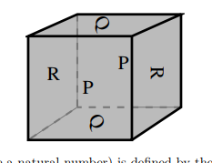
9. Describe a CW complex structure for the lens space $L(p, 1)$ and compute $\pi_1, H_*$ for it.


## Degree

1. Let $p(x) = \sum_i^na_ix^i$, view $p: \CC \union \infty \selfmap$ and determine its topological degree
2. Let $p(z) = \frac{\prod_i^n z-a_i}{\prod_j^m z-b_j}$ with all $a_i, b_j$ distinct. What is its topological degree?
3. Show that if $f: S^m \into S^n$ and $\exists U \subset S^m$ such that $\restrictionof{f}{U} \cong f(U)$, then $m=n$ and $f$ is surjective.

## Universal Coefficient Theorem (Sheet 10)

1. Identify the following groups up to isomorphism
   1. $\ZZ_m \tensor \ZZ_n$
   2. $\ZZ_{60}^4 \tensor (\ZZ_{24}^3 \oplus \ZZ_8^4 \oplus \ZZ_{120})$
   3. $\ZZ_n \tensor \QQ$
   4. $(\ZZ \oplus \ZZ_n) \tensor (\QQ/\ZZ)$
2. Compute:
   1. $\tor(\ZZ \oplus \ZZ_2 \oplus \ZZ_8, \ZZ \oplus \ZZ_4 \oplus \ZZ_4)$
   2. $\ext(\ZZ \oplus \ZZ_2 \oplus \ZZ_3, \ZZ \oplus \ZZ_4 \oplus \ZZ_5)$
3. Compute the following directly from chain complexes and check using UCT:
   1. $H_*(\RP^n; \ZZ_2)$
   2. $H_*(\RP^n, \ZZ_3)$
   3. $H^*(\RP^n, \ZZ_6)$
4. For any space $X$, show that $H^1(X)$ is free abelian
5. Show that
   $H_*(X; \QQ) = H_*(X;\ZZ)\tensor \QQ$
   $H^*(X; \ZZ) = \hom(H_*(X; \ZZ), \QQ)$
6. Construct a space $X$ such that
   $H_*(X; \ZZ) = (\ZZ, \ZZ_6, \ZZ_{12}, \ZZ \oplus \ZZ_4, 0 \cdots)$
   Compute $H^*(X; \ZZ)$
7. Compute $H_*(\RP^2 \cross \RP^2; \ZZ_2)$
8. Compute $H_*(\Sigma\RP^2 \cross \RP^2; \ZZ)$
9. Compute $H_*(\RP^2\cross \RP^3; \ZZ)$
10. Let $G$ be a topological group. Show that $H_*(G)$ is an algebra. Show that $G\actson H_*(G)$, which factors through the homomorphism $G \into \pi_0(G)$ yielding a trivial action if $G$ is path-connected.

## Homological Algebra (Sheet 11)

1. Show that $\ker A \into A\tensor \QQ$ given by $a \mapsto a\tensor 1$ is the torsion subgroup of $A$.
2. Show that $A\injects B \implies A\tensor \QQ \injects B\tensor \QQ$
3. Find a free resolution of $\QQ$ as a $\ZZ$-module.
4. Compute $\tor(\QQ, A)$
   1. Compute $\tor(\QQ/\ZZ, A)$
5. 
6. Let $R = \ZZ[x,y]$, and $M = R/(x-y), N = R/(x,y)$. Construct free resolutions of $M,N$ to compute:
   - $\ext_R^*(M, M)$
   - $\ext_R^*(M, N)$
   - $\ext_R^*(N, M)$
   - $\ext_R^*(N, N)$
7. Let $\Lambda_*$ be the exterior algebra generated by the symbols $\theset{dx_i}^n$ over a field $k$. Show that letting $d  = \cdot \vee dx_1$ yields a chain complex
   $0 \into \Lambda^0 \into \Lambda^1 \into \cdots \into \Lambda^n \into 0$
   with trivial homology. Compute what happens when $dx_1$ is replaced with an arbitrary non-zero element in $\Lambda^1$.
8. Define $M$ as the group ring $R = \ZZ[\ZZ_2]$ with the action $(\cdot) \times -1$. Construct a free resolution of $M$ and compute $\tor_R^*(M, M)$.
9. Show $\tor_R^*(\cdot, \cdot)$ is symmetric in the following way:
   Given $M, N$, take free resolutions, view $M_* \into M$ as a chain map and tensor with $N_*$ to get a chain map$\psi: M_* \tensor_R N_* \into M \tensor_R N_*$. Show that $\psi$ is a quasi-isomorphism using the exact sequence
   $0 \into (Z_n, 0) \into (N_n, 0) \into (B_{n-1}, 0) \into 0$, then switch the roles of $M, N$.
10. Prove that for a SES $0\into A\into B\into C$, the group $\ext(C,A)$ classifies extensions of $C$ by $A$ up to isomorphism.

## Cohomology Ring (Sheet 12)

Todo 


# Topology Problems: Solutions

## Homotopy

1. **Main Idea**: A linear homotopy projected onto the sphere works.

Let $f: X \to S^n \subset \RR^{n+1}$ be an arbitrary map that fails to be surjective. Then, by definition, there is at least one point $s_0 \in S^n - f(X)$.

Then, $\forall x\in X$, since $f(x) \neq s_0$, there is a unique geodesic $C$ connecting $f(x)$ and $s_0$. So a  variant of the straight line homotopy will work, by interpolating between $f(x)$ and $s_0$ along $C$.

So let $H:X \cross I \to S^n$ be defined by $H(x, t) = P(ts_0  + (1-t)f(x))$, where $P: \mathbb{R}^{n+1} \to S^n$ is given by $P(x) = x/\norm{x}$.
This is well defined, since the denominator is zero iff $f(x) = s_0$, which by assumption is not the case.
This is a homotopy, since $H(x, 0) =P(f(x)) = f(x)$ (since $P$ fixes $S^n$) and $H(x, 1) = P(s_0) = s_0$ (since $s_0 \in S^n$).

2. **Main Idea**: Exact same idea as 1, just a more complicated check.

Take $H(x, t) = P(tf(x) + (1-t)g(x))$.
This is well defined; the only case to check is when the denominator is zero. But $\norm{x} = 0$ iff $x =0$, which would imply $tf(x) +(1-t)g(x) = 0$ and so $tf(x) = -(1-t)g(x)$.

Taking norms and observing that since $f,g \in S^n \implies \norm{f} = \norm{g} = 1$, this forces $t = 1-t$ and thus $t=1/2$. But this would force $(1/2)f(x) = (-1/2)g(x)$ and thus $f(x) = -g(x)$, which we assumed was not the case.

3. **Main Idea**: Linear homotopy fails continuity without the condition from (2), so use complex embedding to avoid the origin at $t=1/2$.

Suppose $n$ is odd and define $f:S^n \to S^n$ to be the antipodal map. Since $n+1$ is even, we have $n+1 =2m$ for some $m\in \NN$, so identify $S^n = S^{2m-1} \subset \RR^{2m} \cong\CC^m$

Then $z\in S^n$ can be written as a vector $z \in \CC^m$ such that $\norm{z} = 1$.

Then define $P: \CC^m \to \CC^m$ by $P(z) = z/\abs{z}$, the projection onto the complex unit sphere, and define $H: \CC^m \cross I \to \CC^m$ by $H(z, t) = P(e^{i\pi t}z)$.

This is a homotopy, since $H(z, 0) = P(z) = z$ (since $\norm{z} = 1$), so this is the identity map. We also have $H(z, 1) = P(-z) = -z$, the antipodal map.

This is well-defined, since $e^{i\pi t} > 0$ and $z \neq 0$, so the linear homotopy in ambient $\CC^m$ avoids the origin and thus the denominator when taking the projection is never zero.

4. $\Leftarrow$: **Main Idea**: Projection and inclusion are homotopy inverses. One composition is equality, the other is just equality *up to homotopy*, but that's all we need!

Suppose $\id_X$ is nullhomotopic.

Then there exists some constant map $g: X \into \theset{x_0}$ for some $x_0 \in X$ where $g(x) = x_0$ and $g \homotopic \id_X$.

This means there is some homotopy $F: X \cross I \into X$ such that $F(x,0) = \id_X(x) = x$ and $F(x,1) = g(x) = x_0$ for all $x \in X$.

So let $p:X \into \theset{x_0}$ be the projection map sending every point to $x_0$, and $\iota: \theset{x_0} \into X$ be the inclusion. We will show that the two compositions are homotopy inverses, from which it follows that $X \homotopic \theset{x_0}$.  This means that $X$ is homotopy-equivalent to a point, and thus by definition contractible.

Then $(p\circ \iota): \theset{x_0} \to \theset{x_0}$ is given by $p(\iota(x_0)) = p(x_0) = x_0$, so this is the identity on the target space $\theset{x_0}$.

Similarly, $(\iota \circ p): X \to X$ is given by $\iota(p(x)) = \iota(x_0) = x_0$, so this is the constant map on $X$ mapping every point from $X$ to $x_0$. But then this map is exactly $g$, and by assumption this is homotopic to the identity on $X$

But then we have $p\circ \iota \homotopic \id_{\theset{x_0}}$ and $\iota \circ p \homotopic \id_X$, so they are homotopy inverses.

$\Rightarrow$: **Main Idea**: One of the homotopy inverses *is* just a constant map.

Suppose $X \homotopic \theset{x_0}$, then there exist a pair of homotopy inverses

$f: X \into \theset{x_0}$ and $g: \theset{x_0} \into X$
such that
$f\circ g \homotopic \id_{\theset{x_0}}$ and $g\circ f \homotopic \id_X$.

Since $\theset{x_0}$ is a single point space, $f$ is necessarily a constant map (i.e. $f(x) = x_0$ for every $x\in X$.)  But then $(g\circ f)(x) = g(x_0) = y_0$ for some constant $y_0 \in X$, so $g\circ f$ is a constant map. By assumption, $g\circ f \homotopic \id_X$, so the identity is homotopic to a constant map.

5. **Main Idea**: Deformation retract $M$ onto its center circle; two spaces that deformation retract onto a common space are themselves homotopy equivalent.

Claim: $S^1 \cross I \homotopic S^1 \cross \theset{*}$
This is because $I$ is contractible, so $I \homotopic \theset{*}$. (Maybe needs further proof)

Claim: $M \homotopic S^1 \cross \theset{*}$.


If both of these claims hold, then we will have $M \homotopic S^1 \cross I$ as two spaces that deformation retract onto a common space.
Identifying $M = I \cross I / \sim$ where $(x, 0) \sim (1-x, 1)$, fix $x=1/2$.

Then consider the subspace $U = \theset{(1/2, y) \mid y \in [0,1]} \subset M$. Claim: $U \cong \theset{*} \cross S^1$ for some point $*$.

$U$ can be written $\theset{1/2} \cross (I/\sim)$, and since $(1/2, 0) \sim (1/2,1)$, we have $I/ \sim =  I /\bd I \cong S^1$, so $U \cong \theset{1/2}\cross S^1$ as desired (taking $* = \frac{1}{2}$).

However, we can define a homotopy from $M$ onto $U$, in the form of a deformation retract.

Let $F: M \cross I \into M$ be defined by $F((x,y), t) = F_t(x,y) = ((1-t)x + \frac{1}{2}t, y)$. Then $F((x,y), 0) = (x,y) = \id_M$, and $F((x,y), 1) = (\frac{1}{2}, y) \subseteq U$. Moreover, if $(x,y) \in U$, then $(x,y) = (\frac{1}{2}, y)$ and $F((x,y), t) = ((1-t)\frac{1}{2} + \frac{1}{2}t, y) = (\frac{1}{2} - t\frac{1}{2} + \frac{1}{2}t, y) = (\frac{1}{2}, y) = (x,y)$, so $F = \id_U$. This makes $F$ a deformation retract from $M$ onto $U$, and so $M \homotopic U$.

But then, summarizing our results, we have $S^1 \cross I \homotopic S^1 \cross \theset{*} \cong S^1 \cross \theset{\frac{1}{2}} = U \homotopic M$, and so $S^1 \cross I \homotopic M$ as desired.

6. **Main Idea**: Using a funky deformation retract. See Hatcher, PDF page 55, Example 1.23. Add picture!!

Deformation retract $\\R^3 - S^1$ onto $S^2 - U$, where $U$ is a diameter inside $S^2$ also passing through the middle of $S^1$ in the interior. This can be done by moving points outside of $S^2$ towards the surface, and points inside $S^2$ just move away from the $S^1$ inside (either towards $U$ or towards the surface of $S^2$, so they don't hit $S^1$).

Then take a geodesic between the endpoints of the diameter on $S^2$, pick any point $p$ on the geodesic, and move both diameter points towards it. This yields $S^2 \vee S^1$ at the point $p$.

7. **Main Idea**: Nothing to it. Homotopy:

1. $A \homotopic \Delta \homotopic S^1$
  1. $a \homotopic d \homotopic o \homotopic S^1$
2. $B \homotopic 8 \homotopic S^1 \vee S^1$
  1. $b \homotopic o \homotopic S^1$
3. $C \homotopic *$
  1. $c \homotopic l \homotopic *$
4. $D \homotopic S^1$
  1. $d \homotopic o \homotopic S^1$
5. $E \homotopic *$
  1. $e \homotopic d \homotopic S^1$
6. $F \homotopic *$
  1. $f \homotopic *$
7. $G \homotopic *$
  1. $g \homotopic 8 \homotopic S^1 \vee S^1$
8. $H \homotopic *$
  1. $h \homotopic l \homotopic *$
9. $I \homotopic *$
  1. $i \homotopic \theset{*_1, *_2}$
10. $J \homotopic *$
  1. $j \homotopic i \homotopic \theset{*_1, *_2}$
11. $K \homotopic *$
    1. $k \homotopic K \homotopic *$
12. $L \homotopic *$
    1. $l \homotopic *$
13. $M \homotopic *$
    1. $m \homotopic *$
14. $N \homotopic *$
    1. $n \homotopic *$
15. $O \homotopic S^1$
    1. $o \homotopic S^1$
16. $P \homotopic D \homotopic S^1$
    1. $p \homotopic P \homotopic S^1$
17. $Q \homotopic O \homotopic S^1$
    1. $q \homotopic p \homotopic o \homotopic S^1$
18. $R \homotopic D \homotopic S^1$.
    1. $r \homotopic l \homotopic S^1$
19. $S \homotopic *$
    1. $s \homotopic S \homotopic *$
20. $T \homotopic *$
    1. $t \homotopic l \homotopic *$
21. $U \homotopic *$
    1. $u \homotopic U \homotopic *$
22. $V \homotopic *$
    1. $v \homotopic V \homotopic *$
23. $W \homotopic *$
    1. $w \homotopic W \homotopic *$
24. $X \homotopic *$
    1. $x \homotopic X \homotopic *$
25. $Y \homotopic *$
    1. $y \homotopic v \homotopic *$
26. $Z \homotopic *$
    1. $z \homotopic Z \homotopic *$

This results in a partition of the alphabet into the following homotopy types:

- $\theset{A, D, O, P, Q, R, S^1}$
  $\union \theset{a,b,d,e,g,o,p,q}$
- $\theset{C, E, F, G, H, I, J, K, L, M, N, S, T, U, V, W, X ,Y, Z, *}$
  $\union \theset{c,f,h,k,l,m,n,r,s,t,u,v,w,x,y,z}$
- $\theset{B, S^1 \vee S^1}$
- $\theset{i, j, \theset{*, *}}$

Homeomorphisms: ignore ligatures!!

1. $\theset{A, R}$
  Can remove a point to obtain two components homeomorphic to $\theset{I, F}$ respectively.

2. $\theset{D, O, S^1}$
  These all have no single point that can be removed to disconnect the space.

3. $\theset{B,S^1 \vee S^1}$
  Remove point at junction

4. $\theset{C, G, I, J, L, M, N, S, U, V, W, Z, [0,1]}$
  These all have a point that can be removed to yield **two** components, but no points that yield **three**. (Intuitively, all can be obtained by twisting a straight wire.)

5. $\theset{E, F, T, Y, \bigvee_{i=1}^3 [0,1]}$
  These all have a point that can be removed to yield 3 connected components homeomorphic to $I$. This is the "pasting" point in the vee.

6. $\theset{H, K, \bigvee_{i=1}^5 [0,1]}$
  Can remove **two** points to disconnect each into **five** components.

7. $\theset{P, Q, S^1 \vee [0,1]}$
  Both contain a nontrivial loop.

8. $\theset{X, \bigvee_{i=1}^4 [0,1]}$
  Can remove **one** point to separate into **four** components.

8. **Main Idea**: Show that both spaces are a deformation retract of the same space. (See Hatcher, Proposition 0.18, p. 25)

Suppose we have the following maps

$$
f: S^1 \into X\\
g: S^1 \into X
$$

where $f \homotopic g$. Then there exists a homotopy

$$H: S^1 \cross I \into X$$

such that $H(z, 0) = f(z)$ and $H(z,1) = g(z)$.

Then define
$$
P \definedas X \coprod_f B^2\\
Q \definedas X \coprod_g B^2
$$

We want to that $P$ and $Q$ are homotopy-equivalent. In order to do so, we will construct a larger space which deformation retracts onto both $P$ and $Q$, which is a homotopy equivalence.

With $H$ in hand, we can define the space $R = X \coprod_H B^2 \cross I$, where we recognize $S^1 = \bd B^2$. In particular, $S^1$ is a subspace of $B^2$.

Claim: Both $P$ and $Q$ are subspaces of $R$.
Since $H(z, 0) = f(z)$. So considering $X \coprod_H B^2 \times \theset{0} \cong X \coprod_f B^2 = P$. A similar argument holds at the point $1\in I$. (*Not a strong argument*)

But note that $B^2 \cross I$ is a solid cylinder, and so can be deformation retracted onto the outer shell plus one of the "lids". Formally, this would be given by $S^1 \times I \cup B^2 \cross \theset{p}$ for some $p\in [0,1]$.

Claim: choosing $p=0$ induces a deformation retract of $R$ onto $P$, and choosing $p=1$ induces a deformation retract of $R$ onto $Q$.

Proof: ?

## Fundamental Group

1. **Main idea**: just algebraic manipulations using the $\pi_1$ functor and unravelling definitions.

Let $X$ be path connected and simply connected, and let $x,y \in X$ be two arbitrary points. Then consider two paths,
$\gamma: I \into X, \gamma(0) = x, \gamma(1) = y$
$\alpha: I \into X, \alpha(0) = x, \alpha(1) = y$.

We would like to show $\gamma \homotopic \alpha$.
Since $X$ is simply connected, we know that $\pi_1(X) = 0$. This means that for any $a,b \in \pi_1(X), a = b = e$, the identity element in this group.

So we construct two loops: one as $\gamma \bar\alpha$, the other as $\alpha\bar\gamma$. Apply the $\pi_1$ functor yields $[\gamma\bar\alpha] = e = [c_x] = [\alpha\bar\gamma]$, where $[c_x]$ is the equivalence class of the constant path at $x$, and equivalently the identity element in $\pi_1(X)$.
Lemma: If $f\homotopic g$, then $f\circ h \homotopic g \circ h$ for any $h$.

But this says $\gamma\bar\alpha \homotopic c_x$ and $\alpha\bar\gamma \homotopic c_x$. But $\gamma \homotopic c_x \circ \gamma \homotopic (\alpha\bar\gamma) \circ \gamma \homotopic \alpha\circ (\bar\gamma \circ\gamma) \homotopic \alpha$, which is what we desired.

2. **Main Idea** Homotopies on maps $S^1\into X$ are cylinders, find a way to continuously map a cylinder onto a disk given the existence of such a homotopy.
Let $X$ be path connected, $\pi_1(X) = 0$, and let $f:S^1 \into X$ be arbitrary. Then $f(S^1) \subseteq X$ is a path in $X$, and since $\pi_1(X) = 0$, this path is homotopic to a point $x_0$. So $f$ is homotopic to the constant map $c_{x_0}: S^1 \into X, z \mapsto x_0$.

So let $H:S^1 \cross I \into X$ be this homotopy. We know that $H(z, 0) = f(z)$ and $H(z, 1) = c_{x_0}(z) = x_0$.

Claim: Consider quotient $\frac{S^1\cross I}{S^1 \cross \theset{1}}$ with the projection map $p: S^1 \cross I \into S^1 \cross \theset{1}$. Then $H$ factors through the quotient uniquely (why?), and there exists a unique $\hat H$ making this diagram commute:

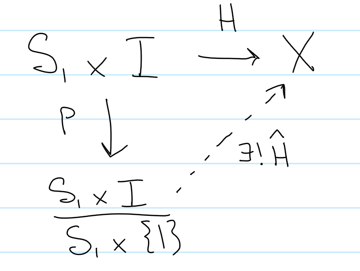

This follow from the universal property of the quotient in $\mathbf{Top}$, where it is sufficient that $H$ is constant on $S^1 \cross \theset{1}$ - but this is exactly what was deduced above.

However, the quotient object constructed is homeomorphic to $D^2$, as per the following diagram

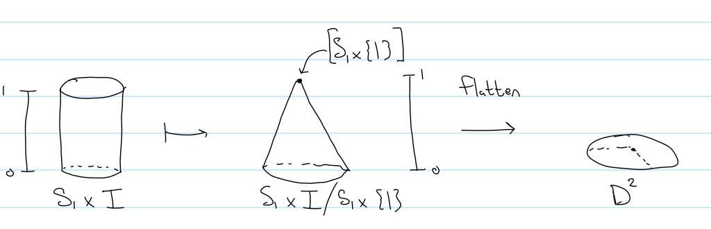

Here, we just recognize that $S^1 \cross I$ is a cylinder, and quotienting at the $t=1$ point in $I$ simply collapses the top portion of the cylinder to a point, forming a cone. We then take the flattening map to just project every point on the cone directly downwards onto the base circle, yielding $D^2$.

(Note: I guess this map can be constructed as $\Phi: S^1 \cross I \into D^2$ where $\Phi(z, t) = z(1-t)$. Since $t=1$ on $S^1 \cross \theset{1}$, $\Phi(z, 1) = 0$ and this is exactly the kernel of $\Phi$. Continuous as product of continuous functions, need to check injective/surjective and show inverse is continuous.)

Need to check injective/surjective, show that kernel is $S^1 \cross 1$, then use first isomorphism theorem.)

But then $\hat H$ is exactly a continuous map from $D^2 \into X$, as desired.

3. $\Rightarrow$ Let $[\alpha] \in \pi_1(X\cross Y, (x_0, y_0))$ be an arbitrary loop in $X \cross Y$. Then $\alpha$ is equivalently a map $S^1 \into X \cross Y$. Considering $S^1$ to be a subset of $\RR^2$, we can parameterize $\alpha$ as $\alpha(z) = \alpha(x+iy) = (\alpha_x(x), \alpha_y(y))$ in components. In particular, since $\alpha$ is continuous, so are $\alpha_x, \alpha_y$. Moreover, since $\alpha(0) = \alpha(0 + i0) = (x_0, y_0)$, we have $\alpha_x(0) = x_0, \alpha_y(0) = y_0$.
(Note: alternatively, given the product, we have projections $p_X, p_y$, so we can define the map $\alpha \mapsto (p_X \circ \alpha, p_Y \circ \alpha)$)

But then $\alpha_x: S^1 \into X$ and $\alpha_y: S^1 \into Y$ are loops entirely in $X, Y$ at the respective base points, and so we can define the map
$F: \pi_1(X\cross Y, (x_0, y_0)) \into \pi_1(X, x_0) \cross \pi_1(Y, y_0)$ by
$[\alpha] = [(\alpha_x, \alpha_y)] \mapsto ([\alpha_x], [\alpha_y])$

This is injective, since $([a],[b]) = ([c],[d])$ on the RHS means that $[a] = [c], [b] = [d]$ in the fundamental groups, and thus $a\homotopic c, b\homotopic d$ in the spaces. We want to show that $[(a,b)] = [(c,d)]$, which would follow if $\alpha(x+iy) = (a(x),b(y)) \homotopic \beta(x+iy) = (c(x),d(y))$ in $X\ \cross Y$. ...?

This is surjective, because if $([a], [b])$ are elements in the right-hand side, then $a(0) = a(1) = x_0$ and $b(0) = b(1) = y_0$, so we can consider $(a,b): I \into X \cross Y$ where $(a,b)(z) = (a,b)(x+iy) = (a(x), b(y))$. This is then a loop in $X\cross Y$, since $(a,b)(0) = (a(0), b(0)) = (0,0) = (x_0, y_0)$ and similarly $(a,b)(1) = (a(1), b(1)) = (x_0, y_0)$. So this is actually a map $(a,b): S^1 \into X \cross Y$, or in other words, a loop in $X\times Y$ based at $(x_0, y_0)$, which lifts to an element of the fundamental group on the LHS.

Maps in both directions are continuous, since a vector function is continuous iff its component functions are continuous.

This is well-defined, due to the fact that if $a \homotopic b$, then $p_X \circ a \homotopic p_X\circ b$, and $F = (f_x, f_y)$ is a homotopy iff its components functions are homotopies.

4. Let $A = S^n - \theset{n_p = \text{North Pole}}, B = S^n - \theset{s_p = \text{South Pole}}$. Then $A\union B = S^n$ and $A\intersect B = S^n - \theset{n_p, s_p}$. Since $A,B$ are open and path connected, we can apply van Kampen's theorem to obtain $\pi_1(X) = \pi_1(A) * \pi_1(B)$ amalgamated over $\pi_1(A\cap B)$. But $A \cong \RR^{n} \cong B$ via stereographic projection, and since $\RR^n$ is contractible, $\pi_1(\RR^n) = 0 = \pi_1(A) = \pi_1(B)$. So $\pi_1(X) = 0 * 0 = 0$ as desired.

This follow because we can compute $A \cap B \cong \RR^n - \theset{\text{pt}} \cong S^n{-1}$, and so $\pi_1(A\intersect B) = \pi_1(S^n) \cross \pi_1(\RR^1) = 0 \cross 0 = 0$, and so has the presentation $\pi_1(A\cap B) = \left< w \mid w^1 = e\right>$. We can then look at the inclusions
$i: A\cap B \into A$
$j: A\cap B \into B$
and the induced homomorphisms
$I: \pi_1(A\cap B) \into \pi_1(A)$
$J: \pi_1(A\cap B) \into \pi_1(B)$.
But since both sides in both maps are trivial, these are constant maps between identities.
We can then present the group $0 = \pi_1(A) =\left< a\mid a^1 = e\right>$ and since $I(w) J(w)^{-1} = e e^{-1} = e$, we have $\pi_1(B) = \left< b \mid b^1 = e\right>$, so $\pi_1(A) *_{\pi_1(A\cap B)} \pi_1(B) = \left< a,b \mid a^1 =b^1 = e\right>$.

(See https://en.wikipedia.org/wiki/Seifert%E2%80%93van_Kampen_theorem for presentation of amalgamated product)

5. WLOG, assume $p_0, p_1$ are the north and south poles of $S^2$. We can then form a deformation retract of $X$ onto the equator of $S^2$, which is equal to $S^1$. To do so, just move every point $x$ along the unique great circle connecting $x, p_0, p_1$, and proceed at linear speed towards the equator. This is well defined at every point on $S^2$ *except* the poles, which are not included in $X$, and the equator is fixed at every instant. So this forms a deformation retract.
Alternatively, use the fact that $\RR^n -\pt \cong S^{n-1} \cross \RR$ via polar coordinates, and $S^n - \pt \cong \RR^n$ by stereographic projection. So $S^2 - \theset{p_0, p_1} \cong \RR^2 - \theset{p_1} \cong S^{1} \cross \RR$. But since $\RR$ is contractible, the last one is homotopic to $S^1 \cross \theset {0} \cong S^1$.
**Alternatively**: use the lemma, then $k=2$ and so $S^2 - \theset{p_1, p_2} \homotopic \bigvee_{i=1}^{1}S^1 = S^1$.

6. Lemma: $S^n - \theset{p_i}_{i=1}^k = \bigvee_{k-1}S^{n-1}$, i.e. $S^n$ minus $k$ points is equal to $k-1$ copies of of $S^{n-1}$.
Proof: $S^n - \theset{p_1} \cong \RR^n$ by stereographic projection, so $S^n - \theset{p_1, p_2 \cdots p_k} \cong \RR^n - \theset{p_2, \cdots p_k}$. WLOG, suppose none of these points are zero (otherwise, take a translation away from zero. This is affine and continuous.) Then fix 0 as the base point, and form $k-1$ loops $\alpha_i$, where the $i$th loop encircles $p_i$. Then $\RR^n$ deformation retracts onto $\cup_{i=1}^{k-1} \alpha_i$, which is homeomorphic to $\bigvee_{i=1}^{k-1} S^1$.

7. Theorem: $\pi_1(\bigvee_{i=1}^k S^1) \cong {\Large{*}}_{i=1}^n\ZZ$, the free product of $n$ copies of $\ZZ$.
Proof: By induction, using Van-Kampen's theorem.
Base case: Take $i=1$, then $\pi_1(S^1) = \ZZ$ as proved in Hatcher.
Inductive step: Suppose this holds for all $k < n$, then we have $X = \bigvee^n S^1 = \left( \bigvee^{n-1}S^1\right) \vee S^1$. Let $p$ be the point of common intersection, then let
$U = \bigvee^{n-1} S^1$
$V = S^1 \union \theset{p}$

Then $U\union V = X$, $U \intersect V = \theset{p}$, both $U,V$ are path-connected. Since we have $\pi_1(\pt) = 0$, the amalgamated free product reduces to the usual free product. By the IH, we have $\pi_1(U) = {\Large{*}}^{n-1}\ZZ$, so

$\pi_1(X) = \pi_1(U\cup V) = \pi_1(U) * \pi_1(V) =_{\text{IH}} ({\Large{*}}^{n-1} \ZZ ) * \pi_1(V) = ({\Large{*}}^{n-1} \ZZ) * \ZZ = {\Large{*}}^{n} \ZZ$.

Definition: Let $F_n \definedas {\Large{*}^n} \ZZ$ be the free abelian group on $n$ generators.
Lemma: If $n\neq m, F_n \not\cong F_m$.
Proof: If $F^n \cong F^m$, then $\ZZ^n \cong \ZZ^m$. But then tensor both sides with $\ZZ_2$ over $\ZZ$, yielding $\ZZ^n \otimes_\ZZ \ZZ_2 \cong Z^m \otimes_\ZZ \ZZ_2$. But the LHS is isomorphic to $(\ZZ/2\ZZ)^n$, while the RHS is isomorphic to $(\ZZ/2\ZZ)^m$. *(Why?)*
These are both finite groups - there are 2 elements in $\ZZ/2\ZZ$, so the first has $2^n$ elements and the latter has $2^m$ elements. But if $2^n=2^m$, then $n=m$. The lemma follows from the contrapositive.

Now we have all we need - let $X = S^2 - \theset{p_1, p_2}$ and $Y = S^3 - \theset{q_1, q_2}$. Then by the previous problems, $X \homotopic S^1$ and $Y \homotopic S^2$, so if $S^2 \cong S^3$ then $X \homotopic Y$ and $S^1 \homotopic S^2$. But $\pi_1(S^1) = \ZZ$ and $\pi_1(S^2) = 0$, so $S^1 \not\simeq S^2$, a contradiction.

8. Here we go:


  1. Let $\alpha(t) = e^{2\pi it}$ where $t \in [0, 1]$, be a loop in $S^1$ parameterized by $t$, which goes around $S^1$ exactly once. Then under the map $f: z \mapsto z^n$, we obtain $f(\alpha(t)) = e^{2\pi n i t}$ where $t \in [0,1]$. This resulting loop then goes around $S^1$ $n$ times, so the induced homomorphism on $\pi_1(S^1) = \ZZ$ is the map $f^*: \ZZ \into \ZZ$ given by $f^*(a) = na$.

  2. Define $\alpha$ as above, and define $f: S^1 \into S^1$ to be the antipodal map, so $f(z) = -z$ for $z \in S^1 \subset \CC$. We then left $\alpha$ to the fundamental group, and define $f_*([\alpha]) = [f \circ \alpha]$. Computing, we have $(f\circ \alpha)(t) = f(\alpha(t)) = -e^{2\pi i t}$. Where $\alpha(0) = \alpha(1) = 1 + 0i$, we have $(f\circ \alpha)(0) = (f\circ \alpha)(1) = -1 + 0i$. But note that $\alpha$ was a counter-clockwise loop in $S^1$, and the image of $\alpha$ is also a counter-clockwise loop. So this maps the generator $[\alpha] \in \pi_1(S^1, 1)$ to the generator $[\alpha'] \in \pi_1(S^1, -1)$. But since $S^1$ is path-connected, the fundamental groups at these two base points are isomorphic.
  Alternatively: the antipodal map on $S^1$ is homotopic to the identity map (since $n=1$ is odd), so $[f\circ \alpha] = [f][\alpha] = [\id][\alpha] = [\alpha]$, so the induced homomorphism on $\pi_1(S^1)$ is the identity map.

  3. Let $\alpha(t) = e^{it}$ where $t\in [0, 2\pi]$ be a counter-clockwise loop in $S^1$; then $[\alpha]$ generates the fundamental group. Then $f^*([\alpha]) = [(f\circ \alpha) (t)] = [e^{it} \mapsto e^{2\pi i \sin t}]$. Then just consider how $\sin$ behaves in each quadrant. In quadrant 1, as $t$ ranges from $0, \pi/2$ then $\sin t$ ranges from 0 to 1, so $\alpha$ is exactly traced out. In quadrant two, $\bar\alpha$ is traced out, since $\sin t$ decreases from 1 to 0. This happens again in the bottom quadrants, so we have $f^*([\alpha]) = [\alpha\bar\alpha\alpha\bar\alpha] = [\alpha][\alpha]^{-1}[\alpha][\alpha]^{-1} = [\id]$. But the identity element in $\ZZ$ is  0, so the induced homomorphism on $\ZZ$ is $f^*(a) = 0$, the homomorphism sending everything to 0.

9. From complex analysis, $W(f(\alpha(t))) = Z_f - P_f = 4 - 1 = 3$. No idea how to approach with induced maps on the fundamental group of $S^1$ or $\CC - \theset{0}$.

10. Let $M$ be the mobius strip, identified as $I\cross I / (t,0) \sim (1-t, 1)$, and let $x_0 = [(1, \frac{1}{2})] = [(0, \frac{1}{2})]$. Let $X$ be the line $(t, \frac{1}{2})$ for $t\in I$; by the identification of the endpoints this is actually a copy of $I / \bd I \cong S^1$ inside of $M$ representing the middle circle of the strip. But then $M$ deformation retracts onto $S^1$ by just moving every point in $I\cross I$ horizontally towards this line, so $M \homotopic S^1$ and $\pi_1(M) \cong \ZZ$, generated by the loop described which we'll call $\alpha$.

To see what the boundary curve is, label the corners $a,b$ with the suitable identification. Then take a path from $a$ to $b$ on the right-hand boundary of the square. By sliding this through $I\cross I$, this is homotopic $\alpha$. But similarly, the path from $b$ to $a$ on the LHS of the square is also homotopic to $\alpha$, so the loop $a\into b \into a \homotopic \alpha^2$, so if $[\alpha] = 1 \in \pi_1(M)$, then $[a\into b\into a] = 2$.

11. First note that $\pi_1(S^1\cross S^1) \cong F^2$, the free group on two generators, say $[\alpha], [\beta]$ corresponding to the two nontrivial loops on the torus - say $\alpha$ is the longitudinal loop, and $\beta$ is the meridian. Then if $\gamma$ is a loop on a torus, then you can just count how many times it winds longitudinally and around the meridian, say $m$ and $n$ times respectively. Then $\gamma$ can be homotoped into $m$ copies of $\alpha$ and $n$ copies of $\beta$ based at $x_0$. So the induced map is $f_\sharp: F^2 \into F^2$ given by $\alpha \mapsto \alpha^m, \beta \mapsto \beta^n$. Since $F^2 \cong Z\cross Z$, we equivalently have $[\alpha] = (1,0), [\beta] = (0,1)$, and then $f_\sharp : Z^2 \into Z^2$ is given by $(1,0) \mapsto (m,0)$ and $(0,1) \mapsto (0,n)$.

## Group Actions

1. 

## Covering Spaces

1. Any covering map $p: S^1\cross S^1 \into \RP^2$ would induce an injection on fundamental groups, but $\pi_1(T) = \ZZ^2$ and $\pi_1(\ZZ_2)$ - but there are no homomorphisms between these groups. Why? One of them has an element of order 2, the other does not.

2. Theorem: if $M_g \surjects M_h$ is an $n-$sheeted covering space, then $g = n(h-1) +1$.

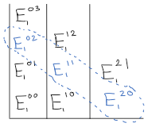

3. Draw CW square for $T$ and cut down the center to see two copies of $K$.

4. Let $p: \tilde G \surjects G$ be such a covering, $a,b\in \tilde G$, we then want to show that $p(a)p(b) = p(a\star b)$ for some group operation $\star$ which we need to construct.


Pick a basepoint $x\in G$ and any point $\tilde x \in p^{-1}(x)$. Since $\tilde G$ is path connected, pick two paths $\alpha, \beta$ from $\tilde x$ to $a,b$ respectively.

Now define a path $f: I \into G$ by $f(t) = (p\circ \alpha)(t) \cdot (p\circ \beta)(t)$, that is, evaluating $f, g$ at a given time in $\tilde G$, projecting the results down into $G$, and multiplying them there. By uniqueness of path lifting, this yields a lift $\tilde f: I \into \tilde G$

Then define $a\star b = \tilde f(1)$, the endpoint of $\tilde f$ in $\tilde G$. Then by construction,

$p(a\star b) = p(\tilde f(1)) = f(1) = (p\circ\alpha)(1)\cdot (p\circ\beta)(1) = p(a)p(b)$.
(Need to show this is continuous, and doesn't depend on $\alpha,\beta$?)

5. Since $T^n = \prod_nS^1$, we have $\pi_1(T^n) = \prod_n \pi_1(S^1) = \ZZ^n$. We can also construct a cover $p:\RR^n \into T^n$ by just taking $\RR \surjects S^1$ the usual cover in each coordinate, yielding the covering space $\tilde X = \RR^n$ over $X = T^n$.

By Hatcher (prop 4.1), the induced maps $p_*^i: \pi_i(\tilde X) \into \pi_i(X)$ is an isomorphism for $i \geq 2$. But $\pi_i(\RR^n) = 0$ for $i \neq 0$, so by this isomorphism $\pi_i(T^n) = i \geq 2$.

6. General construction: construct a tree $T$ by picking a basepoint in $G$ and adding a vertex for every non-backtracking walk in $G$.

In this case, it's the infinite 3-valent graph (also called the infinite $k-$regular tree)

This is the universal cover, because $T$ is connected and acyclic (i.e. a tree). This means that $\pi_1(T) = 0$, so $T$ is simply connected. Since universal covers are simply connected and unique up to isomorphism, this is it.

7. Generators of the subgroups:

1. $\left< ab^{-1}, aba^{-2}, a^3b^{-1}a^{-2}, a^3\right>$
2. $\left< b, aba^{-1}, a^2ba^{-2},a^3\right>$
3. $\left<b^2, ba, a^3, aba^{-1}\right>$
4. $\left<b\right>$
5. $\left<ba, b^{-1}a\right>$

Relevant covers:

1. 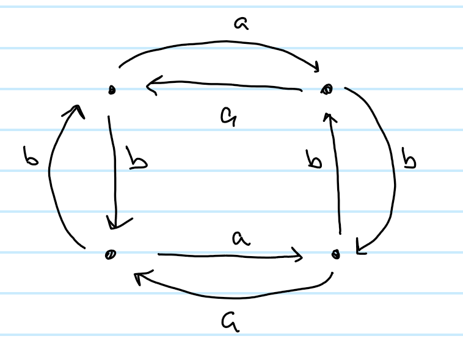
2. 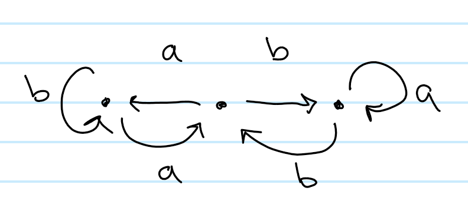
3. 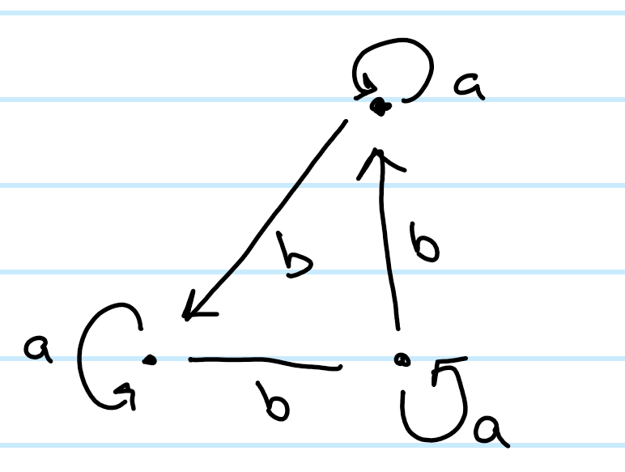
4. 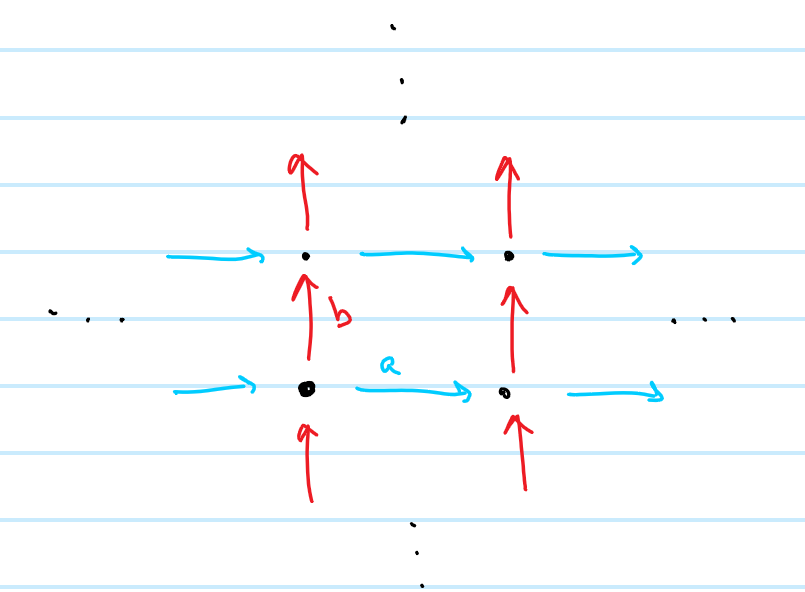
5. Let $T$ be a copy of the Cayley Tree on two on the two generators $a, b$, then:
  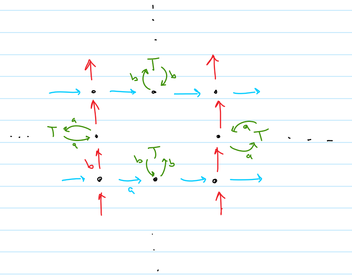

8. This is just the Cayley graph over $\ZZ \cross \ZZ$, or essentially the integer lattice: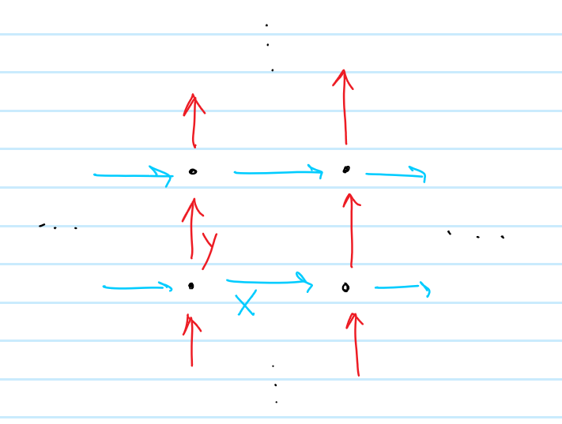

9. It's helpful to note that $\left< (1,0), (0, p) \right> \subset \left< (1,0), (0,1) \right> \cong \ZZ \cross \ZZ \subset \RR \cross \RR$ is an index $p$ subgroup.

## Simplicial Homology

1. Todo 

1. Figure 8
  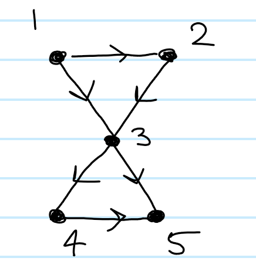
  Here we have:
  $C_3 = \emptyset$
  $C_1 = [12], [23], [13], [34], [35], [45] \cong \ZZ^6$
  $C_0 = [1], [2], [3],[4], [5] \cong \ZZ^5$

  So we have $C_2 \into C_1 \into C_0 \cong 0\xrightarrow{\del_2} \ZZ^6 \xrightarrow{\del_1} \ZZ^5\xrightarrow{\del_0} 0$

  Computing boundary operators, we have

  $\del_1([12]) = [2] - [1]$
  $\del_1([23]) = [3] - [2]$
  $\del_1([13]) = [3] - [1]$
  $\del_1([34]) = [4] - [3]$
  $\del_1([35]) = [5] - [3]$
  $\del_1([45]) = [5] - [4]$

  $\del_0 = 0$

  And so
  $H_0 = \ker \del_0/\im\del_1 = \frac{C_0}{<\del_1([ij])>}$, but from the above calculation we have $[5] = [4] = [3] = [2] = [1]$ in the quotient, so there is just one generator and $H_0  \cong \ZZ$.

  Note that $\del_2$ is an injection from 0 into $C_1$, since there are no 2-simplices. Moreover, one can generate two 1-cycles, so we have $H_1 = \frac{\ker \del_1}{\im \del_2} =\frac{<[23]-[31] + [12],~[45] - [35] + [34]>}{0} \cong \ZZ^2$.

  One way to see that these are the generators is to pretend there are two 2-simplices, $[123], [345]$ and compute $\del_2$ of both of them. Since $\del_1\del_2 = 0$, anything in the image of $\del_2$ would have to go to zero anyways, and would thus be in the kernel of $\del_1$. Since it's not actually the boundary of any 2-chain, it doesn't become trivial in homology.

  So we have $H_2 \into H_1 \into H_0 = 0 \into \ZZ^2 \into \ZZ$.

2. $S^2$
  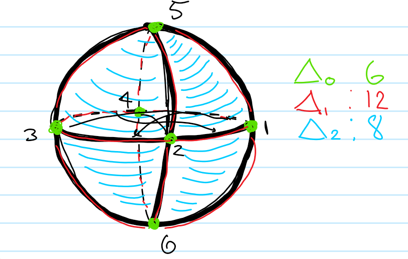
  So we have
  $C_0 = 1,2,3,4,5,6$
  $C_1 = 12,14,15,16,23,25,26,34,35,36,45,46$
  $C_2 = 126, 236, 346, 146, 125, 235, 345, 145$

  $C_3 = \emptyset$

  And $0 \xrightarrow{\del_3} C_2 \xrightarrow{\del_2} C_1 \xrightarrow{\del_1} C_0 \xrightarrow{\del_0} 0 \cong 0 \xrightarrow{\del_3} \ZZ^{8} \xrightarrow{\del_2} \ZZ^{12} \xrightarrow{\del_1} \ZZ^{6} \xrightarrow{\del_0} 0$
  We have $\del_1([ij]) = j-i$ and $\del_2([ijk]) = jk -ik +ij$.

  We know in advance we should have $\prod H_n = (\cdots,0, \ZZ, 0, \ZZ)$.
  
  For $H_0 = \frac{\ker \del_0}{\im \del_1} = \frac{C_0}{\left<\theset{j-i \mid i < j}\right>}$. In the quotient, we see $1=6=3=2=5=4$ by just taking the indicated walk on the graph, so there is one generator in the quotient and $H_0 \cong \ZZ$.

  For $H_1 = \frac{\ker \del_1}{\im \del_2}$, we just note that there are 6 2-cycles, so each are in the kernel of $\del_1$, but each of them comes from a 2-cell, so is in the image of $\del_2$. So both groups in question are $\ZZ^8$, and the quotient is zero.
  For $H_3 = \frac{\ker\del_2}{\im\del_3}$, since $\im\del_3 = 0$, we can just look at $\del_3([123456]) = 23456 - 13456 + 12456 - 12356 +12346 - 12345$. This is an element (and the only one) that goes to zero under $\del_2$, it generates $\ker\del_2$. So there is one generator, and $H_3 =\ZZ$.

3. $\RP^2$

4. $S^2 \union_f D^2$, where $f$ attaches to the equator

5. $T\union_f D^2$, where $f$ attaches inside the torus


## Mayer Vietoris Problems

### $\RP^2$
We start with a few known facts. Let $A=M$, the Mobius strip, and $B= D^2$, the solid disk.

- $\RP^2 = M \disjoint_\del D^2$
- $H_*(M) = H_*(S^1)$, by a deformation retract of $M$ onto its center circle.
- $H_*(D^2) = \ZZ\delta_0$
- $H_*(S^1)= \ZZ(\delta_0 + \delta_1)$
- $M \intersect D^2 = \del M = S^1$

From Mayer-Vietoris, we have

```{=latex} 
\begin{tikzcd}
&  &  &  & \cdots 0 \arrow[lllldd, out=0, in=-180, "\delta_3"'] \\
&  &  &  &  \\
H_2 \partial M \arrow[rr] \arrow[rr, "{(i^*, -j^*)_2}"] &  & H_2 M \oplus H_2 D^2 \arrow[rr, "(l^* - r^*)_2"] &  & H_2 \mathbb{RP}^2 \arrow[lllldd, "\delta_2"', out=0, in=-180] \\
&  &  &  &  \\
H_1\partial M \arrow[rr, "{(i^*, -j^*)_1}"] &  & H_1 M \oplus H_1 D^2 \arrow[rr, "(l^*-r^*)_1"] &  & H_1 \mathbb{RP}^2 \arrow[lllldd, "\delta_1"', out=0, in=-180] \\
&  &  &  &  \\
H_0 \partial M \arrow[rr, "{(i^*, -j^*)_0}"] &  & H_0 M \oplus H_0 D^2 \arrow[rr, "(l^* - r^*)_0"] &  & H_0 \mathbb{RP}^2 \arrow[lllldd, "\delta_0"', out=0, in=-180] \\
&  &  &  &  \\
0 &  &  &  &
\end{tikzcd}
```

and plugging in what is known yields

```{=latex}
\begin{tikzcd}
&  &  &  & 0 \arrow[lllldd, out=0, in=-180, "\delta_3"'] \\
&  &  &  &  \\
0 \arrow[rr] \arrow[rr, "{(i^2, -j^2)}"] &  & 0 \oplus 0 \arrow[rr, "l^2 - r^2"] &  & H_2 \mathbb{RP}^2 \arrow[lllldd, "\delta_2"', out=0, in=-180] \\
&  &  &  &  \\
\mathbb{Z} \arrow[rr, "{(i^1, -j^1)}"] &  & \mathbb{Z} \oplus 0 \arrow[rr, "l^1-r^1"] &  & H_1 \mathbb{RP}^2 \arrow[lllldd, "\delta_1"', out=0, in=-180] \\
&  &  &  &  \\
\mathbb{Z} \arrow[rr, "{(i^0, -j^0)}"] &  & \mathbb{Z} \oplus \mathbb{Z} \arrow[rr, "l^0 - r^0"] &  & H_0 \mathbb{RP}^2 \arrow[lllldd, "\delta_0"', out=0, in=-180] \\
&  &  &  &  \\
0 &  &  &  &
\end{tikzcd}
```

where $i: S^1 \into M$ and $j: S^1 \into D^2$.

We can then identify all of the induced maps:

- $i^2: H_2 \del M \into H_2 M \implies i^2: 0 \to 0 \implies i^2 = 0$
- $i^1: H_1 \del M \into H_1 M$, i.e. $i^1: \ZZ \to \ZZ$ where $1 \mapsto 2$
  - Since $M$ deformation retracts onto its center circle, $H_1 M \cong H_1 S_M$ where $S_M$ is the center circle (homotopies induce isomorphisms on homology). But $H_1 \del M$ is generated by a cycle of edges with includes into $\del M$, which retracts onto a cycle that double covers $S_M$, so this map acts by doubling the generator.
- $i^0: H_0 \del M \into H_0 M$, i.e. $i^0: \ZZ \to \ZZ$
- $j^2: H_2 \del M \to H_2 D^2 \implies j^2: 0 \to 0 \implies j^2 = 0$
- $j^1: H_1 \del M \to H_1 D^2 \implies j^1: \ZZ \to 0 \implies j^1 = 0$
- $j^0: H_0 \del M \to H_0 D^2 \implies j_0: \ZZ \to \ZZ$

So we can that the only nontrivial maps are $j^0, i^0, i^1$.


**Claim: $H_2(\RP^2) = 0$:**

We consider the portion of the sequence $$\cdots 0 \mapsvia{} H_2{\RP^2} \mapsvia{\delta_2} H_1 \del M \mapsvia{(i^1, -j^1)} H_1M \oplus H_1 D^2 \cdots\\
\cdots 0 \mapsvia{} H_2\RP^2 \mapsvia{\delta_2} \ZZ \mapsvia{(i^1, -j^1)} \ZZ \oplus 0 \cdots$$

We will show that $\ker \delta_2 = \im \delta_2 = 0$. By the first isomorphism theorem, we would then have $\frac{H_2 \RP^2}{\ker \delta_2} \cong \im \delta_2$ yielding $\frac{H_2 \RP^2}{0} = H_2 \RP^2 \cong 0$.

- *Claim: $\ker \delta_2 = 0$*

  This follows because it is on the left tail of an exact sequence, where $\ker \delta_2 = \im 0 = 0$.

- *Claim: $\im \delta_2 = 0$*

  $$(i^1, -j^1): H_1 \del M \to H_1 M \oplus H_1 D^2$$ is injective; explicitly, it is the map $$M_2: \ZZ \to \ZZ \oplus 0\\~1\mapsto (2, 0)$$

  From above, know that $-j^1$ is a zero map, and that $i^1$ doubles each generator. By this explicit construction, it is injective since 0 maps to 0.

  But then $\ker (i^1, -j^1) = \im \delta_2 = 0$ by exactness.

So now we have:

```{=latex}
\begin{tikzcd}
&  &  &  & 0 \arrow[lllldd, out=0, in=-180, "0"'] \\
&  &  &  &  \\
0 \arrow[rr] \arrow[rr, "{0\times 0}"] &  & 0 \oplus 0 \arrow[rr, "0"] &  & 0 \arrow[lllldd, "0"', out=0, in=-180] \\
&  &  &  &  \\
\mathbb{Z} \arrow[rr, "{x \mapsto (2x, 0)}"] &  & \mathbb{Z} \oplus 0 \arrow[rr, "l^1-r^1"] &  & H_1 \mathbb{RP}^2 \arrow[lllldd, "\delta_1"', out=0, in=-180] \\
&  &  &  &  \\
\mathbb{Z} \arrow[rr, "{(i^0, -j^0)}"] &  & \mathbb{Z} \oplus \mathbb{Z} \arrow[rr, "l^0 - r^0"] &  & H_0 \mathbb{RP}^2 \arrow[lllldd, "\delta_0"', out=0, in=-180] \\
&  &  &  &  \\
0 &  &  &  &
\end{tikzcd}
```

**Claim: $H_1(\RP^2) = \ZZ_2$**

Here we are examining this portion of the sequence:

$$
\cdots \ZZ \mapsvia{x\mapsto (2x, 0)} H_1 M \oplus H_1 D^2 \mapsvia{l^1 - r^1} H_1 \RP^1 \mapsvia{\delta_1} H_0 \del M \mapsvia{(i^0, -j^0)} H_0 M \oplus H_0 D^2 \cdots\\
\cdots \ZZ \mapsvia{x\mapsto (2x, 0)} \ZZ \oplus 0 \mapsvia{l^1-r^1} H_1 \RP^1 \mapsvia{\delta_1} \ZZ \mapsvia{(i^0, -j^0)} \ZZ \oplus \ZZ\cdots
$$

In general, we have the first isomorphism theorem: given any map $f$ we have $\frac{\mathrm{dom}f}{\ker f} \cong \im f$. Here we will take $f = l^1 - r^1$ and identify the necessary components to apply this theorem.

- Claim: $\im l^1 - r^1 = H_1 \RP^2$.
  - We use the fact that the maps $(i^*, j^*)$ are all injections, so in particular $0 = \ker (i^0, j^0) = \im \delta_1$ by exactness. Consequently $\ker \delta_1 = H_1\RP^1 = \im l^1 - r^1$ by exactness.
- What is $\ker (l^1-r^1)$?
  - By exactness, $\ker (l^1 - r^1) = \im (x \mapsto (2x, 0)) = 2\ZZ \oplus 0$

By the first isomorphism theorem, we have $\im (l^1-r^1) \cong \frac{\mathrm{dom} (l^1-r^1)}{\ker (l^1-r^1)} = \frac{\ZZ\oplus 0}{2\ZZ \oplus 0} \cong \ZZ_2$.

Note that $l^1 - r^1$ is a nontrivial homomorphism from $2\ZZ\cong \ZZ$ to $\ZZ_2$, of which there is only one: the natural quotient map $x \mapsto x \mod 2$.

There is also no nontrivial homomorphism from $\ZZ_2 \to \ZZ$, so $\delta_1 = 0$.

We now have:

```{=latex}
\begin{tikzcd}
&  &  &  & 0 \arrow[lllldd, out=0, in=-180, "0"'] \\
&  &  &  &  \\
0 \arrow[rr] \arrow[rr, "{0\times 0}"] &  & 0 \oplus 0 \arrow[rr, "0"] &  & 0 \arrow[lllldd, "0"', out=0, in=-180] \\
&  &  &  &  \\
\mathbb{Z} \arrow[rr, "{x \mapsto (2x, 0)}"] &  & \mathbb{Z} \oplus 0 \arrow[rr, "x \mapsto x \mod 2"] &  & \mathbb{Z}_2 \arrow[lllldd, "0"', out=0, in=-180] \\
&  &  &  &  \\
\mathbb{Z} \arrow[rr, "{(i^0, -j^0)}"] &  & \mathbb{Z} \oplus \mathbb{Z} \arrow[rr, "l^0 - r^0"] &  & H_0 \mathbb{RP}^2 \arrow[lllldd, "\delta_0"', out=0, in=-180] \\
&  &  &  &  \\
0 &  &  &  &
\end{tikzcd}
```

## Claim: $H_0(\RP^2) = \ZZ$

Here we examine


$$
H_1\RP^2 \mapsvia{\delta_1} H_0 \del M \mapsvia{(i^0, j^0)} H_0 M \oplus H_0 D^2 \mapsvia{l^0 - r^0} H_0\RP^2 \mapsvia{\delta_0} 0\\
\ZZ_2 \mapsvia{\delta_1} \ZZ \mapsvia{(i^0, j^0)} \ZZ \oplus \ZZ \mapsvia{l^0 + r^0} H_0\RP^2 \mapsvia{\delta_0} 0
$$

Since there is no nontrivial homomorphism from $\ZZ_2 \to \ZZ$, we have $\delta_1 = 0$.

We also have $\delta_0 = 0$ and $\ker \delta_0 = H_0 \RP^2 = \im l^0 + r^0$ making $l^0 + r^0$ surjective, so by the first isomorphism theorem we have $H_0 \RP^2 \cong \frac{\ZZ \oplus \ZZ}{\ker l^0 + r^0} = \frac{\ZZ \oplus \ZZ}{\im (i^0, j^0)}$

By a similar argument used earlier, the double covering of the boundary circle $\del M$ over $S^1$ yields the map $(i^0, j^0): \ZZ \into \ZZ \oplus \ZZ$ given by $x \mapsto (2x, 2x)$ with

**Summary:**

With all of this information, we finally have

```{=latex} 
\begin{tikzcd}
&  &  &  & 0 \arrow[lllldd, out=0, in=-180, "0"'] \\
&  &  &  &  \\
0 \arrow[rr] \arrow[rr, "{0 \mapsto (0,0)}"] &  & 0 \oplus 0 \arrow[rr, "{(0,0)  \mapsto 0}"] &  & 0 \arrow[lllldd, "0"', out=0, in=-180] \\
&  &  &  &  \\
\mathbb{Z} \arrow[rr, "{x\mapsto (2x, 0)}"] &  & 2\mathbb{Z} \oplus 0 \arrow[rr, "{(x,0) \mapsto x \mod 2}"] &  & \mathbb{Z}_2 \arrow[lllldd, "0"', out=0, in=-180] \\
&  &  &  &  \\
\mathbb{Z} \arrow[rr, "{x \mapsto (2x, x)}"] &  & 2\mathbb{Z} \oplus \mathbb{Z} \arrow[rr, "{(x,y) \mapsto x-y}"] &  & \mathbb{Z} \arrow[lllldd, "0"', out=0, in=-180] \\
&  &  &  &  \\
0 &  &  &  &
\end{tikzcd}
```

And so we find $H_*(\RP^2) = \ZZ \delta_0 + \ZZ_2\delta_1$

## Cellular Homology

## Degree

## UCT

## Homological Algebra
