Tags: #qualifying_exam #active_projects #qual_real_analysis

# Week 1: Preliminaries

## Topics

- Continuity and uniform continuity
	- Pathological functions and sequences of functions
- Convergence
	- The Cauchy criterion
	-  Uniform convergence
	-  The $M$-Test
-   Heine-Borel
-   Normed spaces
-   Series and sequences,
	- Convergence
	- Small tails, 
	- limsup and liminf, 
	- Cauchy criteria for sums and integrals
-   Variation and bounded variation

Things that don't explicitly appear in qual problems

-   Baire category theorem, 
-   Nowhere density, 
-   Basic inequalities (triangle, Cauchy-Schwarz)
- Concepts from Calculus
	- Mean value theorem
	- Taylor expansion
	- Taylor's remainder theorem
	- Intermediate value theorem
	- Extreme value theorem
	- Rolle's theorem
	- Riemann integrability
-   Weierstrass approximation

## Background / Warmup / Review

- Derive the reverse triangle inequality from the triangle inequality.
- Let $E\subseteq \RR$. Define $\sup E$ and $\inf E$.
- What is the **Archimedean** property?

### Metric Spaces / Topology
- What does it mean for a metric space to be **complete**?
- Give two or more equivalently definitions for **compactness** in a complete metric space.
- What is an interior point? An isolated point? A limit point?
- What does it mean for a set to be open? Closed?
- What is the **closure** of a subspace $E\subseteq X$?
- What does it mean for $E\subseteq X$ to be a **dense** subspace?
- What does it mean for a family of sets to form a **basis** for a topology?
	- What is a basis for the standard topology on $\RR^d$?
- Let $X$ be a subset of $\RR^d$. Prove the Heine-Borel theorem:
	- Show that $X$ compact $\implies X$ is closed
	- Show that $X$ compact $\implies X$ is bounded
	- Show that a closed subset of a compact set must be bounded.
	- Show that if $X$ closed and bounded $\implies X$ is compact. 
- Find an example of a metric space with a closed and bounded subspace that is not compact.
	- How can this be modified to obtain a necessary and sufficient condition?
- Determine if the following subsets of $\RR$ are opened, closed, both, or neither:
	- $\QQ$
	- $\ZZ$
	- $\ts{1}$
	- $\ts{p \in \ZZ^{\geq 0} \st p\text{ is prime}}$
	- $\ts{ {1\over n} \st n\in \ZZ^{\geq 0}}$
	-  $\ts{ {1\over n} \st n\in \ZZ^{\geq 0}} \union \ts{0}$

### Sequences
- Can a convergent sequence of real numbers have a subsequence converging to a different limit?
- What does it mean for a sequence of functions to converge **pointwise** and to converge **uniformly**?
	- Give an example of a sequence that converges pointwise but not uniformly.
- Prove that every sequence admits a monotone subsequence.
- Prove the monotone convergence theorem for sequences.
- Prove the Bolzano-Weierstrass Theorem.

### Series

-- What does it mean for a series to converge? How can you check this?
		- What does it mean for a series to converge *uniformly*? What do you have to show to prove it does *not* converge uniformly?
- Show that if $\sum_{n\in \NN} a_n < \infty$ converges, then $$a_n \ctz{n}$$.
- Show that convergent sequences *have small tails* in the following sense: $$\sum_{n > N} a_n \ctz{N}$$.
	- Is this a necessary and sufficient condition for convergence?
- State the ratio, root, integral, and alternating series tests.
- Prove that the harmonic series diverges
- Derive a formula for the sum of a geometric series.
- State and prove the $p\dash$test.
- What does it mean for a series to converge absolutely?
	- Find a sequence that converges but not absolutely.

### Continuity and Discontinuity

- What does it mean for a function to be **uniformly continuous** on a set?

- Is it possible for a function $f:\RR\to \RR$ to be discontinuous precisely on the rationals $\QQ$? If so, produce such a function, if not, why?
	- Can the set of discontinuities be precisely the irrationals $\RR\sm\QQ$?

- Find a sequence of continuous functions that does *not* converge uniformly, but still has a pointwise limit that is continuous.

## Exercises

- Find a function that is differentiable but not continuously differentiable.
- Prove the **uniform limit theorem**: a uniform limit of continuous function is continuous.
- Show that the uniform limit of bounded functions is uniformly bounded.
- Construct sequences of functions $\ts{f_n}_{n\in \NN}$ and $\ts{g_n}_{n\in \NN}$ which converge uniformly on some set $E$, and yet their product sequence $\ts{h_n}_{n\in \NN}$ with $h_n \da f_n g_n$ does *not* converge uniformly.
	- Show that if $f_n, g_n$ are additionally bounded, then $h_n$ does converge uniformly.
- Find a sequence of functions such that 
	$$\frac{d}{d x} \lim _{n \rightarrow \infty} f_{n}(x) \neq \lim _{n \rightarrow \infty} \frac{d}{d x} f_{n}(x)$$
- Find a uniform limit of differentiable functions that is not differentiable.
- Prove that the Cantor set is a Borel set.
- Show the Cantor ternary set is totally disconnected; that is show it contains no nonempty open interval.

- 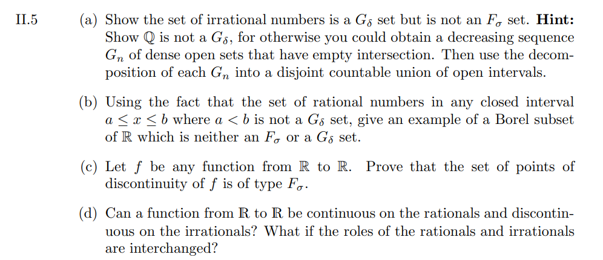
- 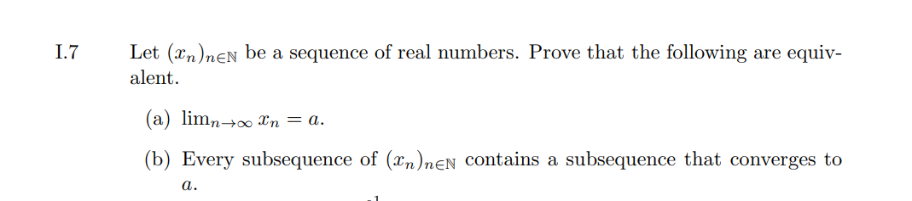

## Qual Questions

- 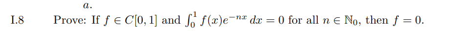
- 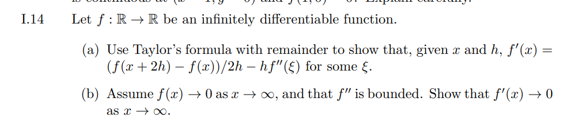
- 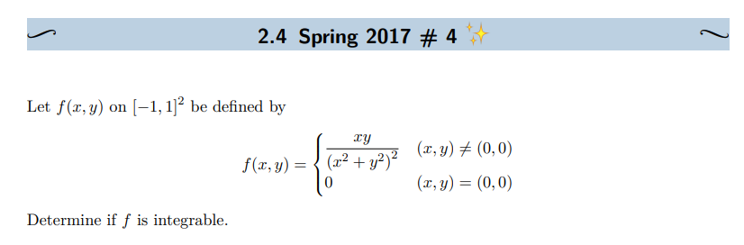
- 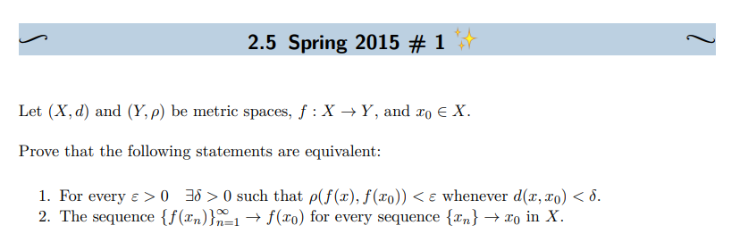
- 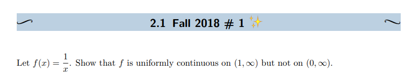
- 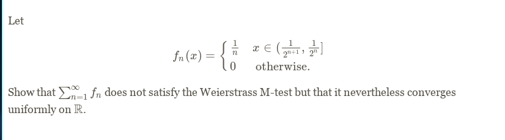
- 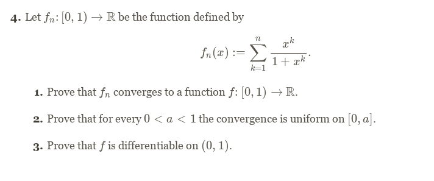
- 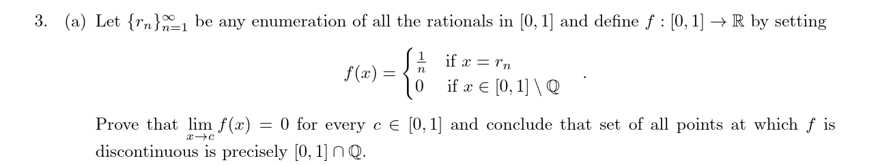
- 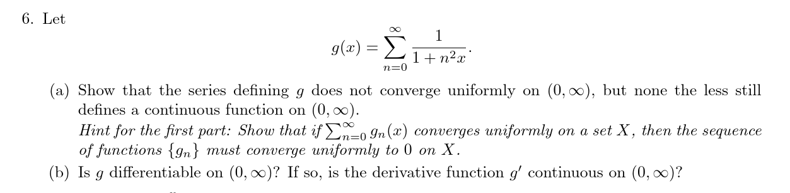
- 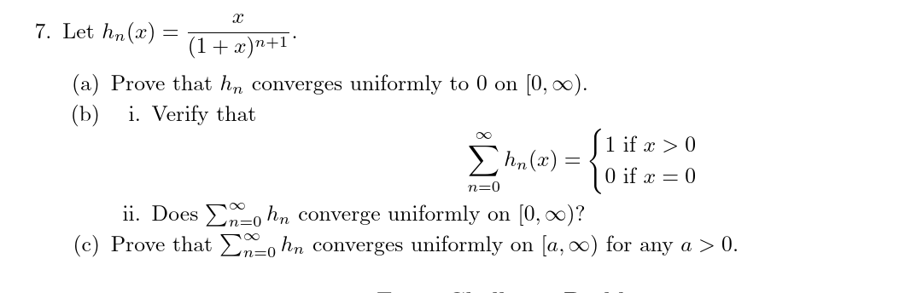
- 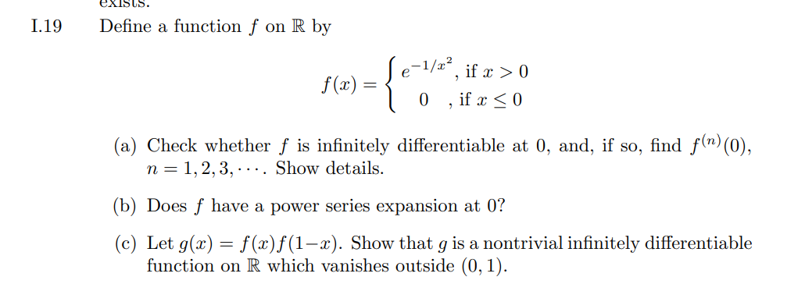
- 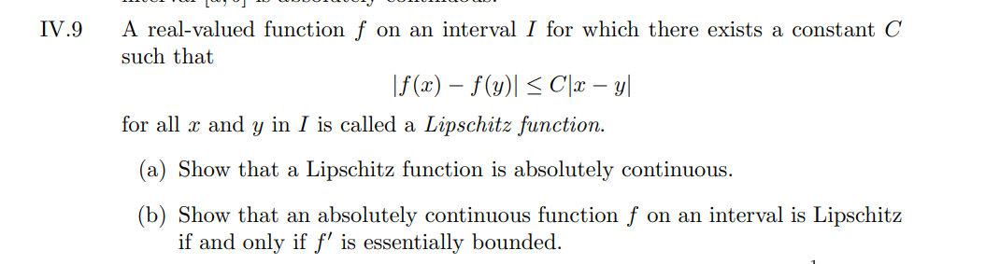
- 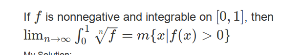
- 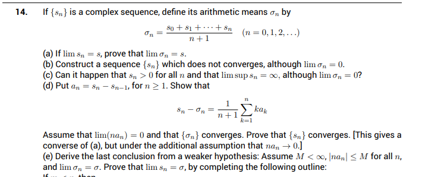
	- Note: outline omitted!

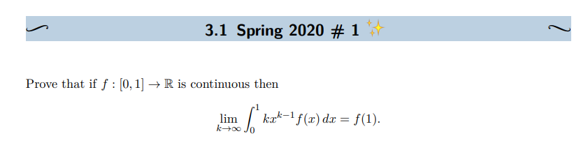

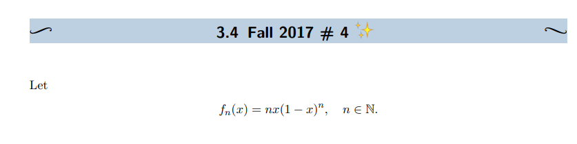
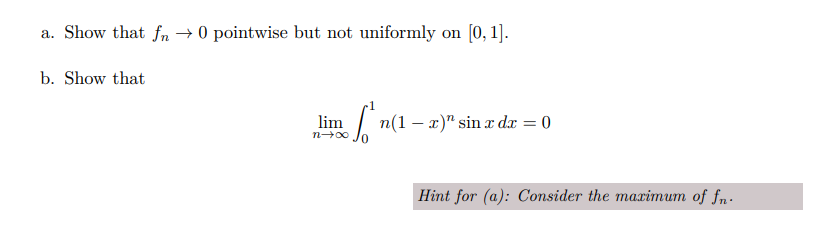

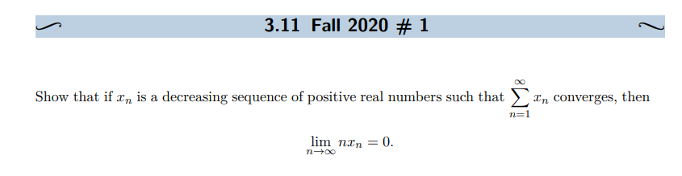

