Tags: #qualifying_exam #active_projects #qual_real_analysis

# Study Guide

References: 

- Folland's "Real Analysis: Modern Techniques", Ch.1
- Stein and Shakarchi Ch.1, Ch.2

## Convergence Tips/Tricks

- Our favorite tools: **metrics** and **norms**!
	- 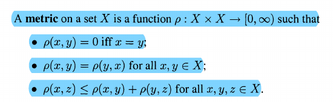
	- So show things are equal by showing $\abs{x-y} = 0$. Know the triangle inequality by heart!
- **Uniform convergence**:
	- 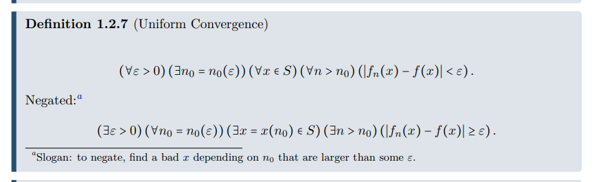
	- Negating: find a bad $\eps$ and a single bad point $x$.
	- Showing a sum converges uniformly: remember that $\sum_{k\geq 1} a_k$ is *defined* to be $\lim_{N\to\infty} \sum_{k\leq N} a_k$. So the trick is to define $f_n(x) := \sum_{k\leq n} a_k$ and then apply the usual criteria above.
	- It's sometimes useful to trade the $\forall x$ in the definition with $\sup_{x\in X} \abs{f_n(x) - f(x)} < \eps$ instead.
- Compare and contrast to **pointwise convergence**, which is strictly weaker:
	- 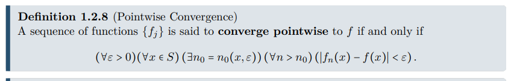
	- The main difference: pointwise can depend on the $x$ and the $\eps$, but uniform needs one $\eps$ that works for *all* $x$ simultaneously.
	- Note uniform implies pointwise but not conversely.
- The sup norm: $\norm{f}_\infty := \sup_{x\in X} \abs{f_n(x)}$
	- A useful way to force uniform convergence: bound your sequence uniformly by a sequence that goes to zero:
	- 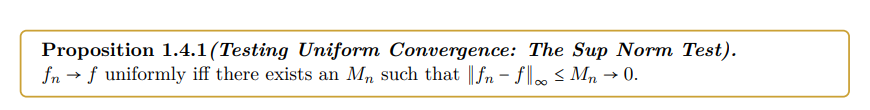
- **Sups and infs**: sup is the least upper bound, inf is the greatest lower bound.
- The $p-$test: 
$$
\sum_{n\geq 1} {1 \over n^p} < \infty \iff p>1
$$
- Useful fact: convergent sums have **small tails**, i.e. 
$$
\sum_{n\geq 1} a_n < \infty \implies \lim_{N\to\infty}\sum_{n\geq N} a_n = 0
$$
- So try bounding things from above by the *tail* of a sum!
- If you can't bound by a tail: as long as you have control over the coefficients, you can pick them to make the sum to converge "fast enough".
	- Example: for a fixed $\eps$, choose $a_n = 1/2^n$. Note that $\sum_{n\geq 1} 1/2^n = 1$, so choose $a_n := \eps/2^n$:
$$
\cdots \leq \sum_{n\geq 1} a_n := \sum_{n\geq 1} {\eps \over 2^n} = \eps \to 0
$$
- The $\eps/3$ trick:
	- 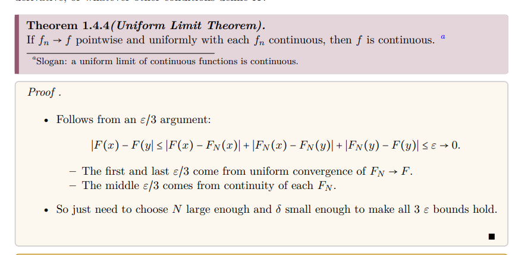
- **The $M\dash$test**:
	- 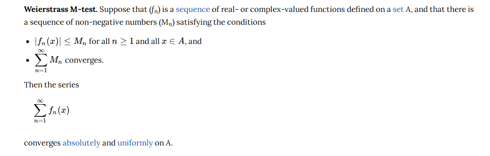

## Measure Theory
-   $F_\sigma$ sets: unions of closed sets ($F$ for *fermi*, French for closed. Sigma for sums, ie unions)
-   $G_\delta$ sets: intersections of open sets
-   $\sigma$ algebras: closed under complements, countable intersections, countable unions
- Some of the most useful properties of measures:

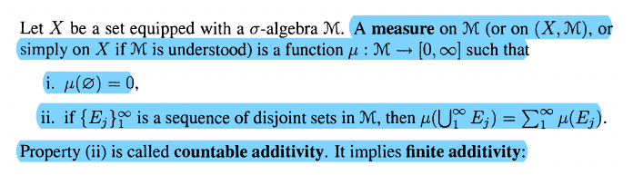

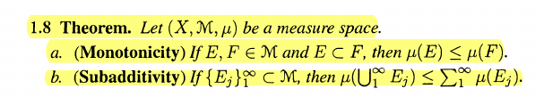

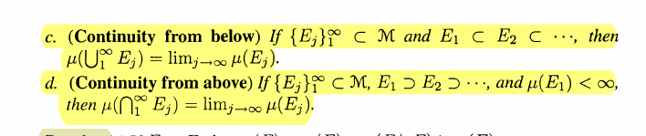

- The proof of continuity of measure contains a very useful trick: replace a sequence of sets $\ts{E_k}$ with a sequence of *disjoint* sets that either union or intersect to the same thing.
	- Example: if $A_1 \subseteq A_2 \subseteq \cdots$, set $F_1=A_1$ and $F_k = A_k \sm A_{k-1}$ for $k\geq 2$. Then $\Union_{k\geq 1} A_k = \Disjoint_{k\geq 1} F_k$.
- Occasionally you need some properties of **outer measures**:

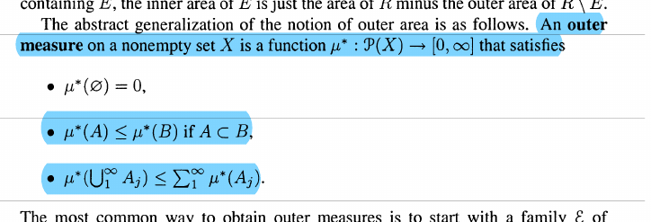

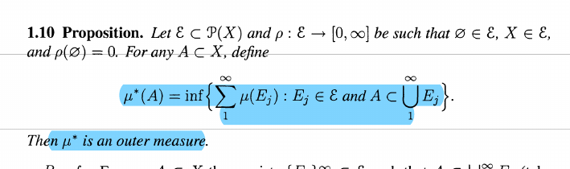

- Outer measure for $\RR^n$: you consider all collections of cubes that cover your set, sum up their volumes, and take the infimum over all such collections:

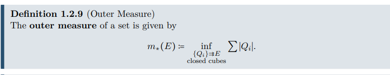

- "Almost everywhere *blah*" : the set where *blah* does not happen has measure zero.
- "Infinitely many/all but finitely many" types of sets, which show up in Borel-Cantelli style problems

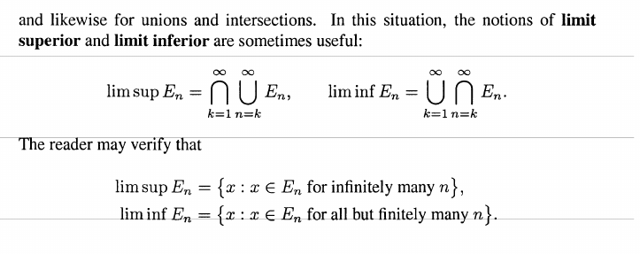

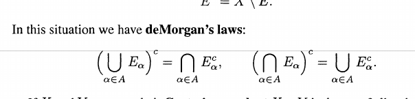

- Lemmas that sometimes show up on quals:

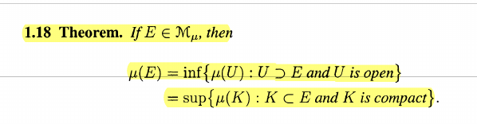

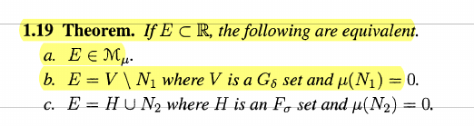

## Fubini-Tonelli

Quick statement:

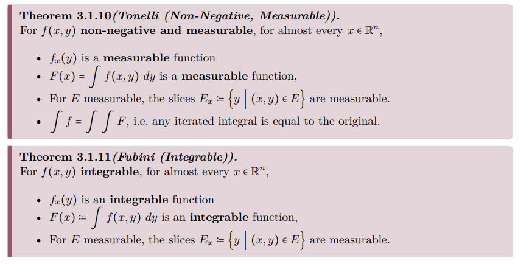

Explained in Stein and Shakarchi (Fubini, which requires **integrability**)

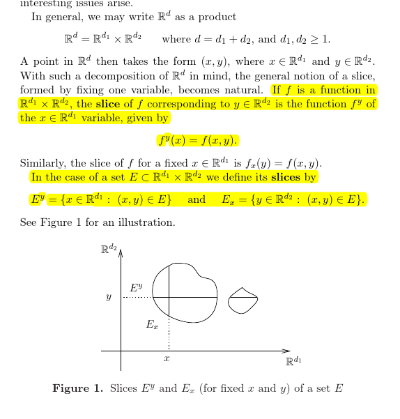

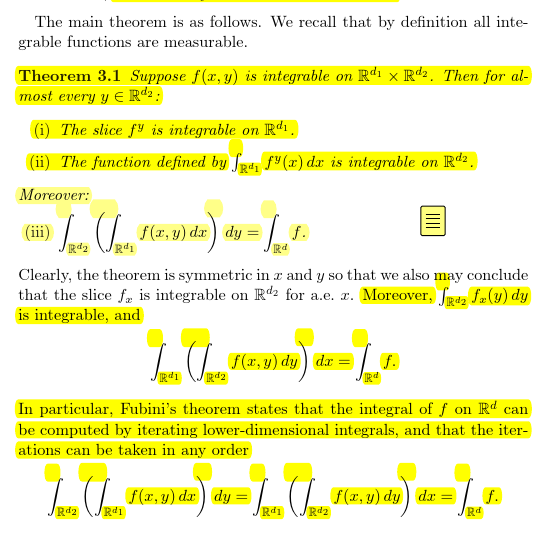

And Tonelli, which only requires **measurability**:

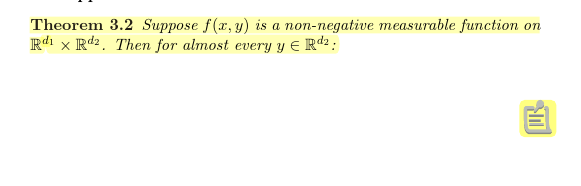

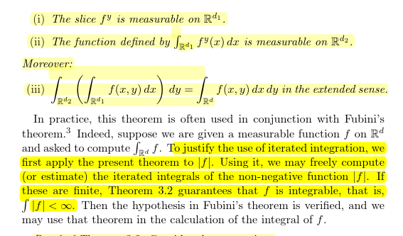

A more precise statement from Folland:

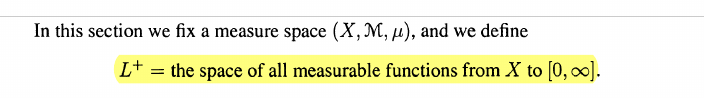

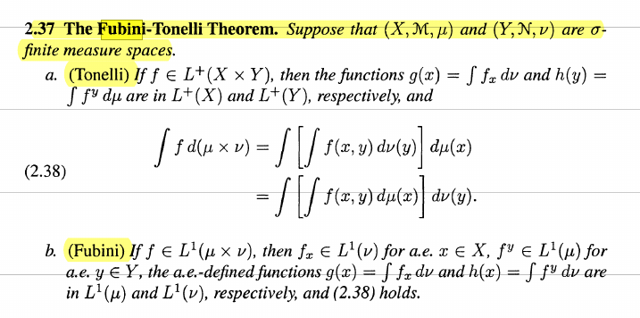

Some things that qual questions are commonly based on:

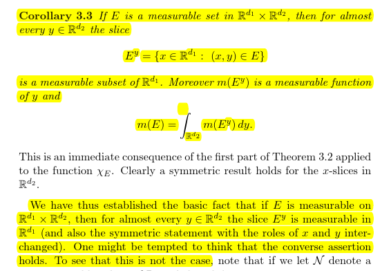

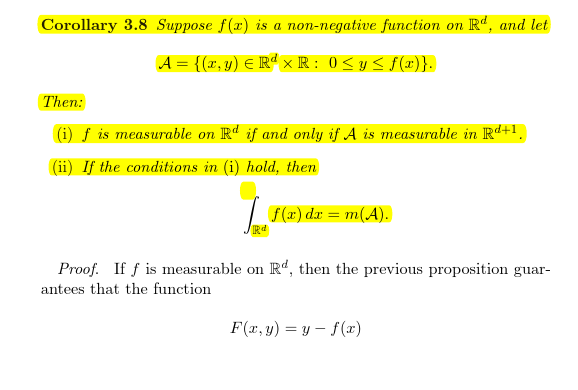

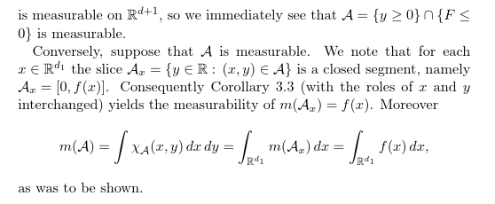

# Qual Problems

> Suggested by Peter Woolfitt!

Spring 2012

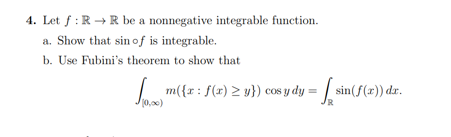

Fall 2016.2

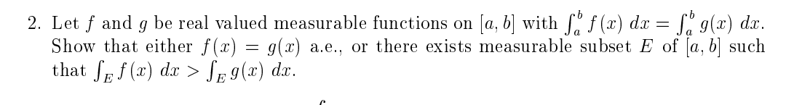

Fall 2018.5

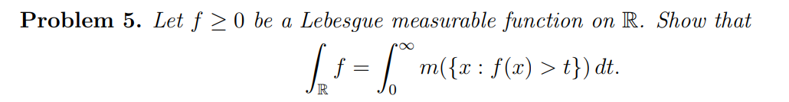

 Spring 2019.4: This is an expanded version of Fall 2018 #5 above.

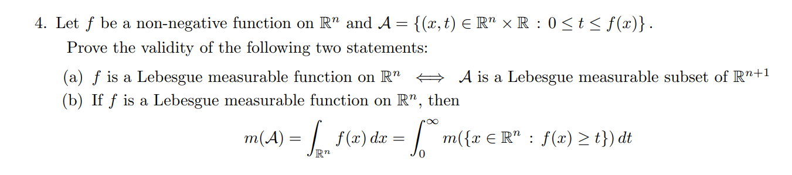

